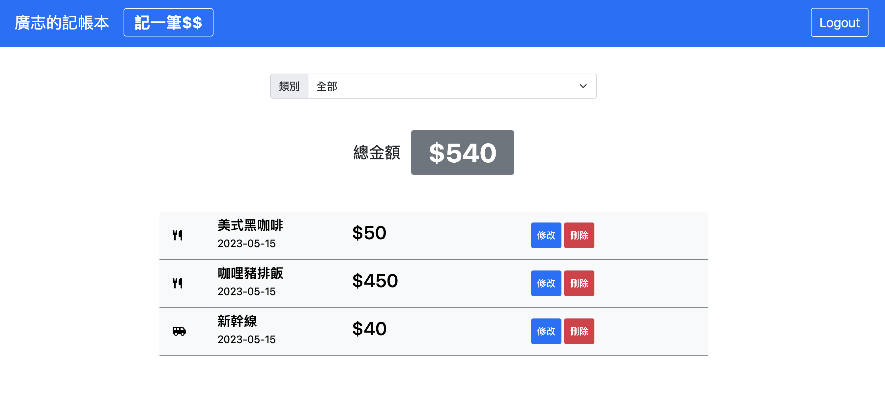

# Expense Tracker 我的記帳本

## **Introduction 專案簡介**

使用 Node.js + Express + MongoDB 製作記帳web app，使用者可以註冊帳號、登入，並查看、新增、編輯或刪除專屬該用戶的收支明細。



### 雲端試用

- 試用連結: [https://glacial-reef-40489.herokuapp.com/](https://glacial-reef-40489.herokuapp.com/)
- 試用帳密1
    - 帳號: [user1@example.com](mailto:user1@example.com)
    - 密碼: 123
- 試用帳密2
    - 帳號: [user2@example.com](mailto:user2@example.com)
    - 密碼: 123

## **Features 功能**

- 使用者可以註冊會員並重新登入使用記帳功能
- 使用者可以使用 Facebook 帳號登入使用記帳功能
- 使用者可以登入會員使用記帳功能
- 使用者可以新增支出項目
- 使用者可以瀏覽支出項目及總金額
- 使用者可以修改支出項目內容
- 使用者可以刪除支出項目
- 使用者可以藉由輸入分類來瀏覽支出項目及總金額

## **Prerequisites 環境設置**

- [VScode](https://code.visualstudio.com/)
- [Git](https://git-scm.com/downloads)
- [Node.js](https://nodejs.org/en/)
- [nodemon](https://www.npmjs.com/package/nodemon)
- [mongoDB](https://www.mongodb.com/)

## **Installation 開始使用**

```
# 開啟終端機 並 Clone 此專案至本機
$ git clone https://github.com/evaaaaawu/expense-tracker.git

# 於終端機進入存放本專案的資料夾
$ cd xxxxx

# 安裝 npm 套件
$ npm install

# 新增.env檔案，並請根據.env.example檔案內資訊設置環境變數

# 啟動專案前，請先建立種子資料，如在終端機中看到 "categorySeeder done!" & "recordSeeder done!"，即表示種子資料建立成功
$ npm run seed

# 啟動伺服器，執行 app.js 檔案
$ npm run dev 
or
$ npm run start

# 若在終端機看到下方訊息代表順利運行，於瀏覽器中輸入該網址(http://localhost:3000)即可開始使用本網站
"Express is listening on localhost:3000"
"mongodb connected!"
```

## **Tech/framework used 開發工具**

- Express 4.17.1
- Express-handlebars 4.0.2
- Express-session: 1.17.1
- bootstrap 5.1.3
- bcryptjs 2.4.3
- connect-flash 0.1.1
- method-override 3.0.0
- mongoose: 5.9.7
- passport 0.4.1
- passport-facebook 3.0.0
- passport-local 1.0.0
- moment 2.29.4
- dotenv 8.2.0